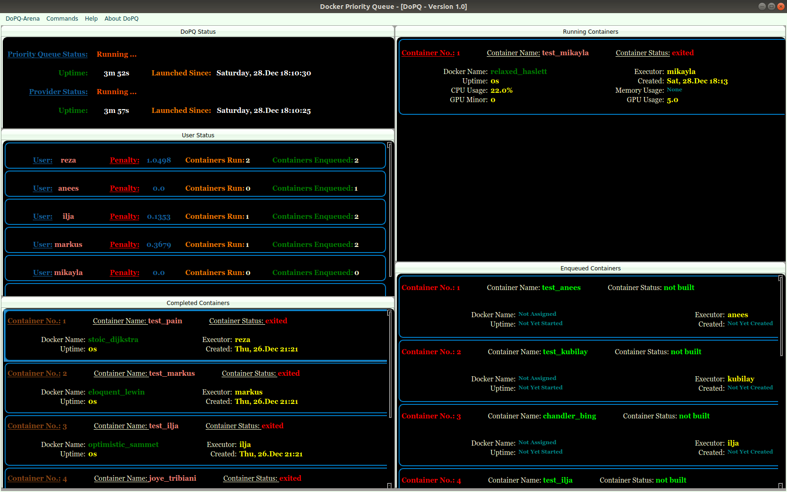

# DoP-Q
## Queue for docker to run projects on a multi-gpu machine ##

__History:__
+ 12.10.2017: Initial commit.
+ 16.10.2017: Changed to python 2.7
+ 31.01.2018: Refactored queue from the ground up. Introduced modules builder.py, container_handler.py, gpu_handler.py and helper_process.py

_HowTo get started:_
> Just download run\_python\_script in examples/simple and zip the content of the folder. Name it to "build\_\[SOME\_NAME\]\_\[YOUR\_NAME].zip", where \[SOME\_NAME\] is some name you may freely choose and where \[YOUR\_NAME] represents your username. Copy it to the container.path directory of the queue and it will be built and run automatically. Please not that \[YOUR\_NAME\] must be authorized to run docker files on the machine. Please speak to some administrator of the machine (Ilja Manakov, Markus Rohm).

__Update History:__
+ 15.04.2019: Decided to move in new interface for better flexibility and introduce server-client communication.
+ 21.06.2019: Beta version of Pyqt4 interface has been integrated to the backend.
+ 18.07.2019: Decided to separate the docker priority queue and provider process completely from the interface. Agreed to implement the system in MVC fashion with client totally separated from the server.

|
:---:|
_**DoPQ Interface [Version 1.0]**_.|
