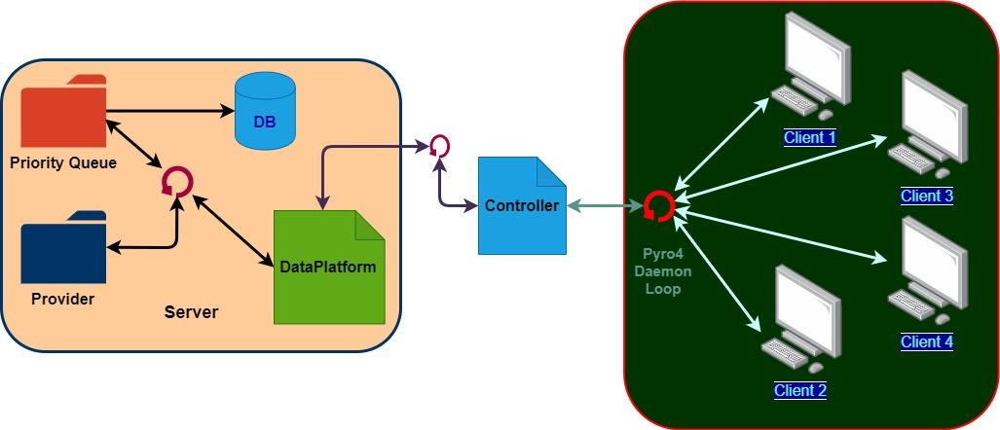
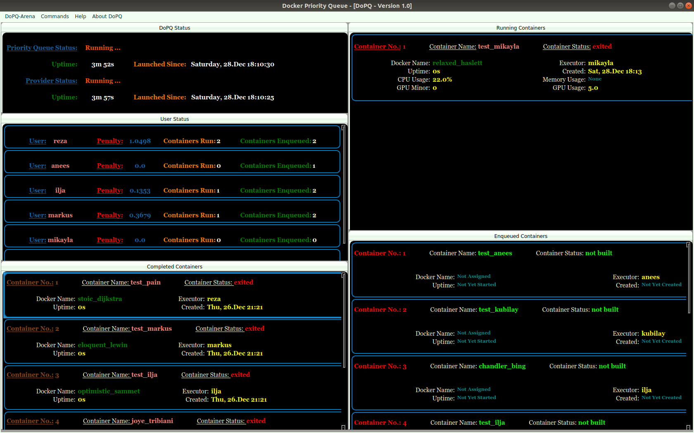

.. DoPQ documentation master file, created by
   sphinx-quickstart on Mon Dec 23 12:47:56 2019.
   You can adapt this file completely to your liking, but it should at least
   contain the root `toctree` directive.

.. raw:: html

	

DoPQ 1.0 documentation!
================================
	.. role:: customtext
	
Welcome! This is the documentation for DoPQ 1.0. It's completely written in Python 3.

DoPQ stands for :customtext:`Docker Priority Queue`. It's a software primarily made for running heavyweight deep learning models in the form of docker containers on a multi-gpu system. Internally it maintains a priority queue, including a penalty scoring system, hence ensures the balance between occupied gpu's among valid users. 

Get the code
-------------

The `source <https://github.com/rezaurrakib/dop-q>`_ is available on Github. For any kind of information, please email to reza.rahman@tum.de

.. toctree::
   :maxdepth: 1
   :glob:
   :caption: Contents

   installation
   overview
   server
   client
   user registration 

DoPQ Architecture
-----------------
DoPQ is build on MVC pattern. From a broader perspective, the whole architecture is a **Server** -- **Client** system. **Server** contains a *provider* and a *priority queue* process constantly running for fetching, building docker images and run those in the central gpu-machine. The **Client** part does the trivial job for updating the priority queue's status, including information about running docker containers, history of completed docker images, how many docker containers are currently lined up in the queue for executing etc. It also provides options for sending commands from the client side to server for valid users registered into the DoPQ database.

	Figure: Inter Process communication between DoPQ Server--Client

The :customtext:`DoPQ User Interface` looks like the following:
	

	Figure: Client interface for DoPQ

