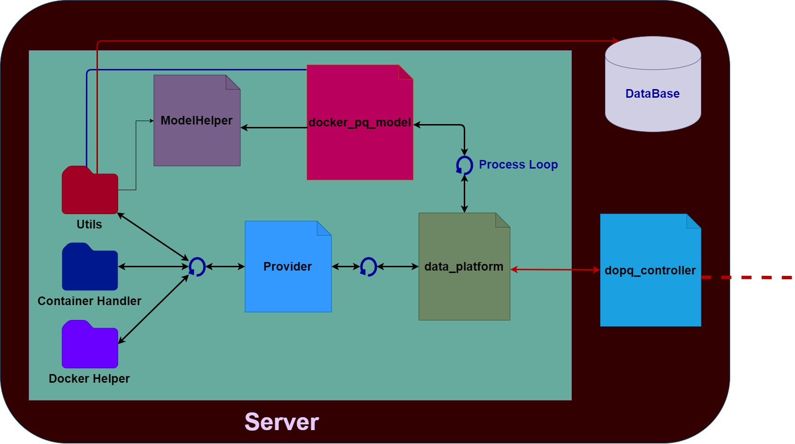
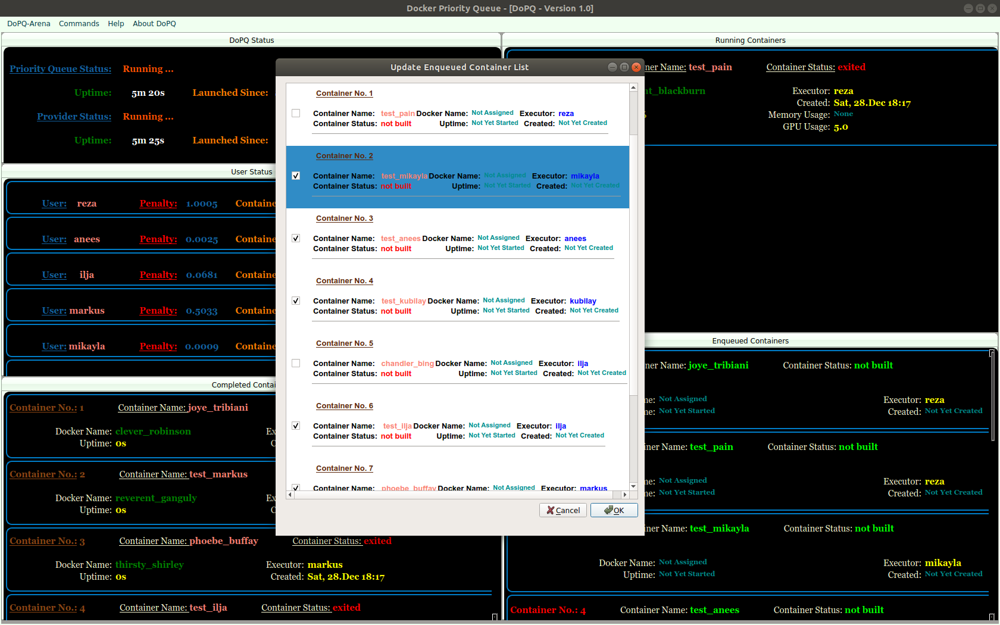

Overview
========
* :ref:`Server Architecture`
* :ref:`DoPQ-Model`
* :ref:`DoPQ-Controller`
* :ref:`Client Architecture`

Server Architecture
--------------------
The DoPQ server module consist of two submodules.
 - DoPQ-Model
 - DoPQ-Controller

DoPQ-Model
----------
DoPQ-Model contains a *data_platform* file through which it starts two different process (**Provider** and **docker_priority_queue**).
 
*Provider* process is responsible for fetching zipped docker folders in the local server machine, unzip them, build the docker images and create docker containers out of them. Provider object is a python multiprocessing obj. 

*docker_priority_queue* is a python threading object. From the provider, when docker container objects are created, it's then pushed in a priority queue, which is controlled by this thread object. After starting, this thread obj continuously search for new docker container objects from *provider* process and execute all the docker containers according to the priority queue. 

*DataPlatform* is a layer between *DopqController* and  *provider* and *docker_priority_queue* processes. It provides some private APIs for Controller class to get information and control the server processes.      

DoPQ-Controller
---------------
*DoPQ-Controller* is the public class for the client processes to communicate with the server processes. It comes up with several public APIs, which can be directly invoked from the client processes. These public APIs are exposed by the *Pyro4* library, so that remote objects from the client side can invoke these methods. The **server_daemon** object, upon registered as a Pyro4 daemon, will be broadcasted under a unique hostname, which is registered in the Pyro4 *Nameserver*.      

	Figure: Server Architecture

Client Architecture
-------------------
DoPQ client module is totally build on **PyQt5** framework. A Client class is responsible for looking up in the namesrver for getting the specific remote object broadcasted by the Pyro4 server daemon. There are two submodules mainly responsible for creating and updating the DoPQ interface. 

 - ViewThread class
 - Pipeline class

**ViewThread** is a PyQt QThread class. The Client class send the remote server object in this class. The ViewThread object then invokes the public APIs of the Controller class in server through that object. After fetching server information, it saves those into several pyqtSignal objects. Simultaneously, the QThread object continuously emit those signals for the interface pipeline in order to show it in an user interface. 

**Pipeline** is the main class for showing and updating information in the user interface. It inherits a customized window layout class fully written on PyQt5 library. There exist  5 subwindows in the UI, showing the following information:

	- How many containers are currently running on the server
	- How many docker containers are in queue now
	- How many contaniners are finished executing 
	- Overall user status in the DoPQ
	- DoPQ system status

Also, there are additional commands that can be sent to the server side from the client side through the UI. Currently the following commands can be sent, but it can be easily extended.

	- Update and delete specific enqueued docker containers
	- Clear the User History
	- Clear the User Status 
	- Shutdown the DoPQ server

For flexible UI designing, a css style layout class **(css_layout.py)** is also defined in the client, which is integrated with the parent window layout class. User can easily update the UI layout through changing in that **css_layout** file.

An example of the client interface with **Update Enqueued Containers** command looks like the following:

	Figure: Interface of Enqueue Update Routine for DoPQ

